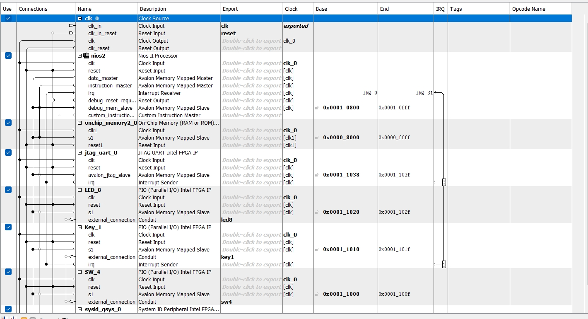

# Lab 1 : “Let there be light” - Implement a led chaser

## 1. <strong>Introduction</strong>
Dans le Lab1, nous utilisons la carte de développement DE10. Notre objectif est de créer un système permettant de contrôler la vitesse et le déclenchement de la course LED à l'aide de boutons et d'interrupteurs.    

Les étapes pour réaliser ce projet comprennent :  
1. Conception matérielle : Conception d'un QSYS, création d'un système Nios II de base, ajout de modules pour contrôler les LED, les boutons, les interrupteurs, etc.  

2. Conception logicielle : Utilisation d'un programme en C pour implémenter un chasseur de 8 LED, ajout d'un bouton pour déclencher le chasseur et utilisation d'Switch pour ajuster la vitesse. Utilisation d'un bouton pour contrôler le démarrage/pause des LED. Ici, j'ai utilisé la méthode de polling.    

Afin d'améliorer la lisibilité et la compréhension du rapport, j'ai ajouté des images pour l'explication et la présentation ainsi que les résultats de mon expérience sous forme de vidéo.

## 2. <strong>Architecture du système</strong>

  
  
<em><strong>Figure 1 : Qsys</strong></em>

Dans la Figure 1, nous avons construit le système QSYS, comprenant NIOS II, RAM, UART ainsi que les ports PIO nécessaires à cette conception. Nous avons ajouté 8 ports de sortie pour contrôler les LED, 4 ports d'entrée pour les switchs, et un port d'entrée pour le bouton key1. La communication entre NIOS et les différents modules se fait via Avalon-MM, et le contrôle de chaque périphérique s'effectue par la lecture et l'écriture à son adresse. En configurant les broches, nous pouvons également définir Key0 comme bouton de réinitialisation.

  
  
<em><strong>Figure 2 : Composants QSYS</strong></em>

Comme montré dans la Figure 2, lors de la conception d'un système QSYS, les trois composants indispensables sont NiosII, onchip et Uart. Quant aux autres composants, nous pouvons les ajouter en configurant les ports d'entrée et de sortie dans les PIO.

## 3. <strong>Progrès et résultats</strong>
Dans cette expérience, j'ai réalisé l'affichage de la course LED, le contrôle de sa vitesse à l'aide des switchs, et le contrôle de son démarrage/pause avec un bouton.   

Voici la vidéo de démonstration de l'expérience :
https://github.com/user-attachments/assets/62965e95-dea5-4bc7-b7d5-7d4497fc399b

## 4. <strong>Conclusion</strong>
En résumé, j'ai beaucoup appris lors de cette expérience. Tout d'abord, dans la conception de QSYS, il est nécessaire de comprendre que les ports communiquent via Avalon-MM. Ensuite, j'ai appris à concevoir un fichier Top pour effectuer le mappage des ports et les connecter aux broches. Enfin, dans les composants conçus par Qsys, nous utilisons le langage C pour concevoir la logique dont nous avons besoin et écrire et lire les données dans leurs adresses.
